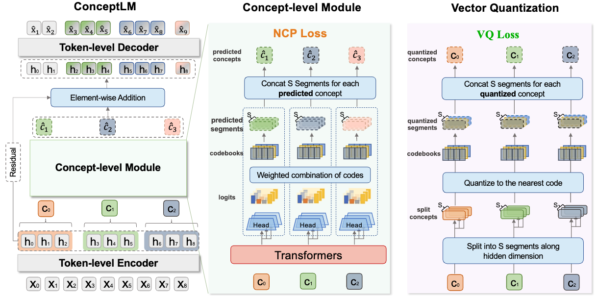

# Next Concept Prediction in Discrete Latent Space Leads to Stronger Language Models

<p align="center">
  <a href="https://arxiv.org/abs/XXXX.XXXXX">📄 arXiv</a> ·
  <a href="https://huggingface.co/collections/yuliang03181/conceptlm">🤗 Hugging Face</a>
</p>

This repository contains the official implementation of **ConceptLM** and **Next-Concept-Prediction (NCP)**, 

- [x] Release ConceptLM models (The largest Pythia and Llama model are released)
- [x] Release test code
- [ ] Release all models, we are going to release all our trained models and training curves
- [ ] Release training code
- [ ] ...


---

## 🔍 Introduction

We propose Next Concept Prediction (NCP), a generative pretraining paradigm built on top of Next Token Prediction (NTP). Our model, ConceptLM, quantizes hidden states using Vector Quantization and constructs a concept vocabulary. It leverages both NCP and NTP to drive parameter updates and generates a concept to guide the generation of the following tokens. 

**Key highlights:**
- Introduce a **Harder** LLM pre-training objective for **NCP**.
- Build up **Concept Representation in Discrete Latent Space (Concept Vocabulary)** upon LLM latent space.
- Introduce a **Novel** architecture **ConceptLM** integrates NCP and NTP.


## 🖼️ Overview

<p align="center">
  
</p>


---

## 📁 Code Structure

We implement the generate function for Llama model. So that the details of ConceptLM_Llama differs from the Pythia and GPT-2 implementations.


```text
.
├── figures/        
├── lm_eval/   
  ├── lm_eval/   
      ├── lm_eval_files/
      ├── ConceptLM_arc/
          ├── ConceptLM_GPT2/
          ├── ConceptLM_Pythia/
          └── ConceptLM_Llama/
      └── README.md
└── README.md
```

## 📁 Quick Start


To reproduce our results, you can download our model first, then run:

```
git clone https://github.com/LUMIA-Group/ConceptLM

cd ./lm_eval

pip install -e .

pip install transformers==4.51, vector_quantize_pytorch, flash_attn

# download our models

bash run_lm_eval.sh

```

## 📖 Citation

If you have any questions or are interested in our work, please feel free to contact us at liuyl03181@gmail.com.

If you find this work useful, please consider citing our paper:

```bibtex
@article{conceptlm2026,
  title   = {Next Concept Prediction in Discrete Latent Space Leads to Stronger Language Models},
  author  = {Yuliang Liu and Yunchong Song and Yixuan Wang and Kewen Ge and Alex Lamb and Qipeng Guo and Kai Chen and Bowen Zhou and Zhouhan Lin},
  journal = {Arxiv},
  year    = {2026}
}
